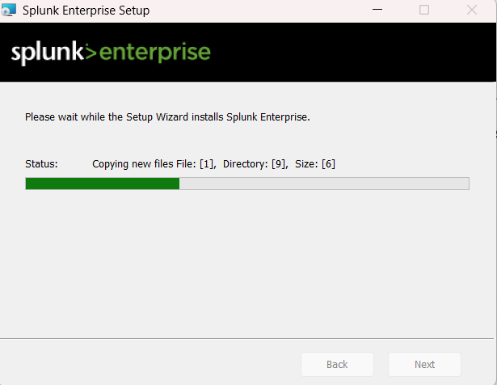
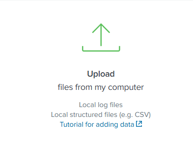
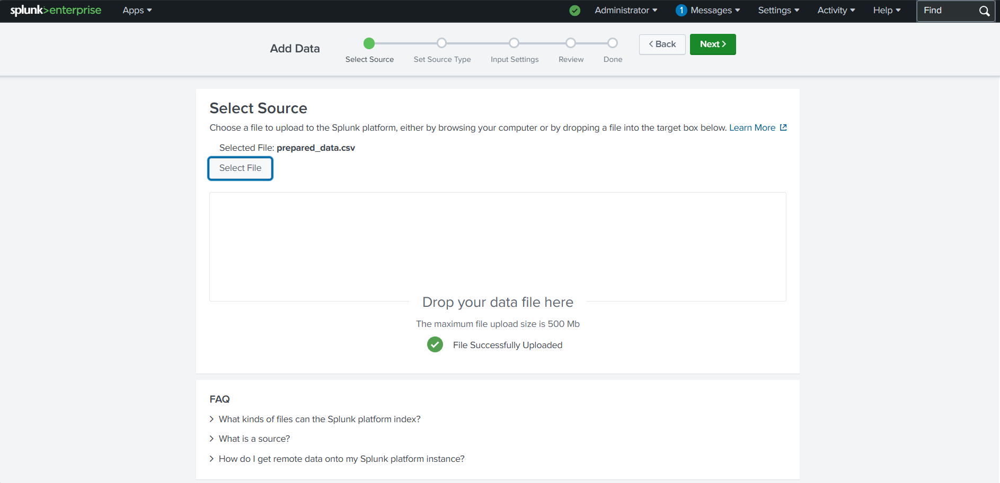
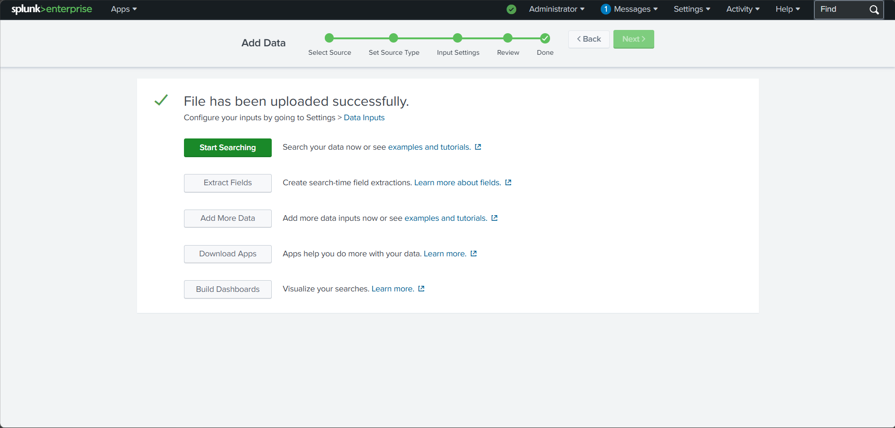
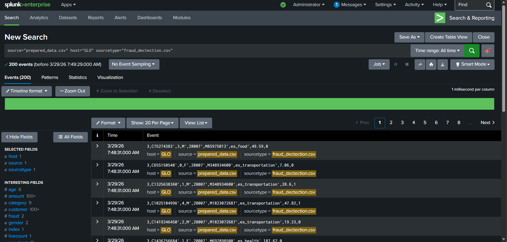
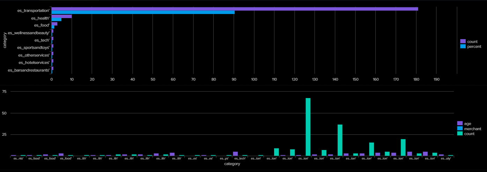
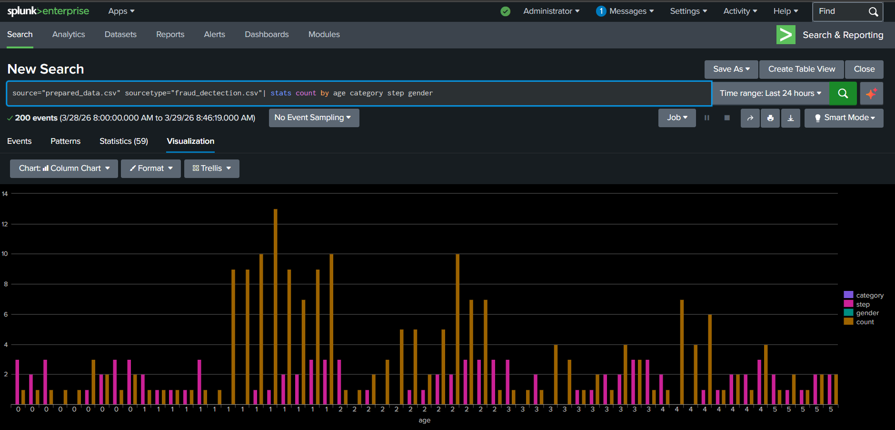
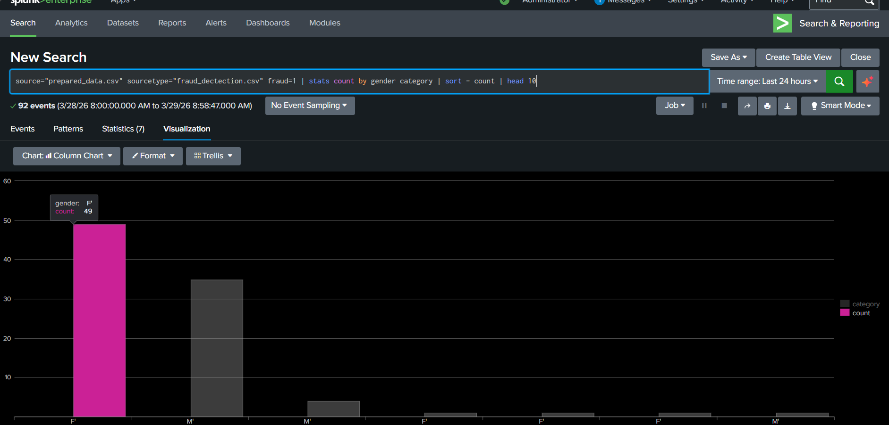
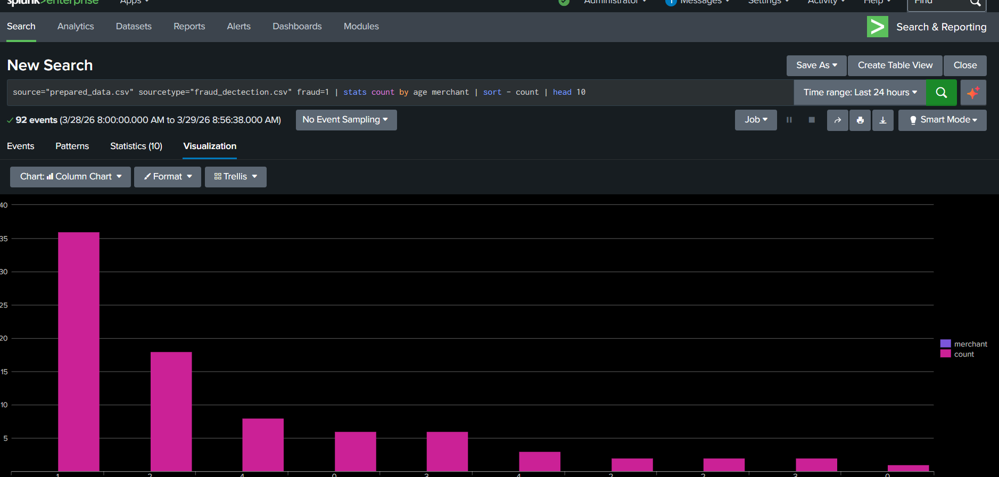

# Task 1 — Splunk Fraud Data Analysis

## Overview

As a cybersecurity generalist at Commonwealth Bank, financial fraud is one of the most critical threats to monitor. In this task I installed and configured **Splunk Enterprise**, imported a simulated fraud transaction dataset, and built a dashboard to surface key fraud trends across customer demographics, transaction categories, and time periods.

The goal was to use data visualisation to make fraud patterns easier to identify — giving the fraud detection team a fast, reliable way to spot suspicious activity.

---

## Environment Setup

**Tool:** Splunk Enterprise (60-day free trial)
**Dataset:** `prepared_data.csv` — simulated fraud transaction data provided by Commonwealth Bank's Fraud team

### Setup Process

| Step | Screenshot |
|------|-----------|
| Installing Splunk Enterprise |  |
| Installation complete |  |
| Splunk login screen |  |
| Navigating to Add Data > Upload |  |
| CSV file selected |  |
| File uploaded successfully |  |
| Splunk ready — 200 events indexed |  |

---

## Dataset

The dataset represents simulated payment transactions across four months (May–August). Each record contains the following fields:

| Field | Description |
|-------|-------------|
| `step` | Month (0=May, 1=June, 2=July, 3=August) |
| `customer` | Customer ID |
| `age` | Age group (0=≤18, 1=19–25, 2=26–35, 3=36–45, 4=46–55, 5=56–65) |
| `gender` | F = Female, M = Male |
| `postcode_origin` | Transaction origin postcode |
| `merchant` | Merchant ID |
| `category` | Purchase category (e.g. es_transportation, es_health, es_food) |
| `amount` | Transaction amount |
| `fraud` | 1 = fraudulent, 0 = legitimate |

**Total events indexed:** 200
**Confirmed fraudulent transactions:** 92

---

## SPL Queries
```spl
-- Count by category, fraud status, age, and merchant
source="prepared_data.csv" sourcetype="fraud_dectection.csv"
| stats count by category fraud age merchant

-- Fraud activity broken down by age, category, month, and gender
source="prepared_data.csv" sourcetype="fraud_dectection.csv"
| stats count by age category step gender

-- Which gender committed the most fraud and in what category?
source="prepared_data.csv" sourcetype="fraud_dectection.csv" fraud=1
| stats count by gender category
| sort -count
| head 10

-- Which age group committed the most fraud and toward which merchant?
source="prepared_data.csv" sourcetype="fraud_dectection.csv" fraud=1
| stats count by age merchant
| sort -count
| head 10
```

---

## Dashboard

### Panel 1 — Count by Category, Fraud, Age, and Merchant



**Finding:** `es_transportation` and `es_health` had the highest overall transaction counts — making them the most active and highest-risk categories to monitor for fraud.

---

### Panel 2 — Fraud Detected by Age, Category, Step, and Gender



**Finding:** Fraudulent activity was not evenly distributed across months. Certain age and category combinations showed concentrated spikes, suggesting possible seasonal or coordinated fraud patterns.

---

### Panel 3 — Fraudulent Transactions by Gender and Category



**Finding:** Female customers recorded the highest fraud count at **49 events**, primarily in the `es_transportation` category. Male customers followed at a noticeably lower count.

---

### Panel 4 — Fraudulent Transactions by Age Group and Merchant



**Finding:** Age group **1 (19–25)** had the highest fraud count at **36 events**. Activity was concentrated toward specific merchant IDs, indicating possible targeted or coordinated fraud.

---

## Summary of Findings

| Question | Finding |
|----------|---------|
| Most active transaction category | `es_transportation` |
| Gender with most fraudulent activity | Female (F) — 49 events |
| Top fraud category for females | `es_transportation` |
| Age group with most fraudulent activity | Age group 1 (19–25) — 36 events |
| Total fraudulent events | 92 out of 200 |

---

## What I Learned

- How to ingest and index structured CSV data into Splunk Enterprise
- How to write SPL queries to filter, aggregate, and sort event data
- How to build a multi-panel Splunk dashboard for fraud reporting
- How visualisation surfaces patterns that raw data alone obscures
- The importance of segmenting fraud data by demographics and categories for actionable insights

---

[Back to main repo](../README.md)
