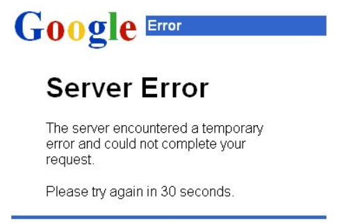

# Task 2 — Incident Response

## Overview

A security incident was reported at Commonwealth Bank. As the assigned cybersecurity analyst, I reviewed the incident timeline, identified the attack type, and outlined a full response — from initial containment through to post-incident activities.

---

## Incident Timeline

| Time | Event |
|------|-------|
| **10:30 AM** | An employee reports receiving an email appearing to be from HR asking staff to update their timesheets. The employee clicked the link, entered credentials on what appeared to be the portal, and was shown an unfamiliar error page. |
| **2:00 PM** | Eight additional reports received. Investigation confirms **62 employees across the Risk Department** received the same email over two days. The emails directed users to a fake site to steal credentials and download malicious software. |
| **3:50 PM** | More employees report shared file drives are inaccessible and Word documents they have previously opened are returning errors. |

### Fake Error Page Displayed After Credential Capture



*After capturing credentials, the attacker's site displayed a generic server error to avoid raising immediate suspicion.*

---

## Analysis

### 1. What type of attack occurred?

**Phishing**
The attacker impersonated HR to trick employees into submitting credentials on a fake website — targeted at a specific department, making this a spear-phishing attack.

**Ransomware / Malware Deployment**
Following credential theft, a malicious payload was delivered to affected machines. Inaccessible drives and locked Word documents are consistent with ransomware encryption.

The attack followed this kill chain:
```
Phishing email → Credential harvesting → Malware execution → Lateral movement to shared drives
```

---

### 2. Immediate Next Steps

- Begin formal documentation of all events, timestamps, and affected systems
- Prioritise the incident based on functional impact, information impact, and recoverability effort
- Advise all affected users to immediately change passwords and security questions

---

### 3. Containment, Resolution, and Recovery

| Phase | Actions |
|-------|---------|
| **Containment** | Isolate affected machines from the network. Block the phishing domain at the firewall and email gateway. Revoke and reset all compromised credentials. |
| **Resolution** | Identify and patch all exploited vulnerabilities. Remove malware from affected hosts. Restore encrypted files from clean backups where available. |
| **Recovery** | Return all systems to operational state. Confirm normal functioning of file shares and applications. Continue monitoring for re-infection or persistence. |

---

### 4. Post-Incident Activities

- **Incident report** — full write-up covering timeline, attack vector, affected systems, and outcomes
- **Lessons learned meeting** — review what happened, what worked, and what needs to improve
- **Security awareness training** — phishing awareness program to help employees recognise similar attacks
- **Email filtering improvements** — tighten gateway rules to catch impersonation attempts
- **Access control review** — apply least-privilege principles where needed

---

## Key Takeaways

- Social engineering remains one of the most effective initial access vectors
- A single phishing click can lead to department-wide credential compromise and ransomware deployment
- Speed of containment directly limits the blast radius of an incident
- Post-incident activities are what prevent the same attack from succeeding again

---

## What I Learned

- How to identify attack types from behavioral indicators and incident timelines
- The incident response lifecycle: identification, containment, eradication, recovery, lessons learned
- How phishing and malware chain together in real-world attacks
- The importance of employee education as a security control

---

[Back to main repo](../README.md)
